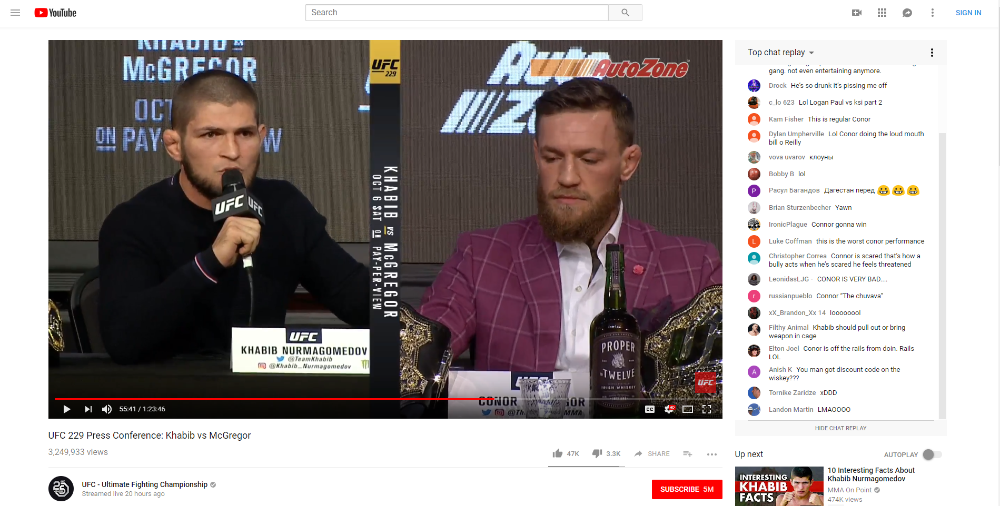
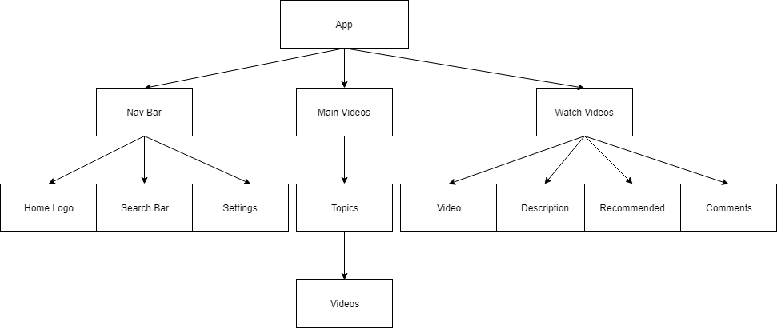

# YouTube Clone

#### By Kevin Ahn

#### Project’s Purpose or Goal: An app where users can watch YouTube videos

#### List the absolute minimum features the project requires to meet this purpose or goal:

* Users can watch videos
* Users can search for videos
* Users can log in to their own YouTube account

#### What tools, frameworks, libraries, APIs, modules and/or other resources (whatever is specific to your track, and yourlanguage) will you use to create this MVP? List them all here. Be specific.

* React with Redux
* YouTube API
* JavaScript, HTML and CSS/SCSS

#### If you finish developing the minimum viable product (MVP) with time to spare, what will you work on next? Describe these features here: Be specific.

* Styling to get the look and feel of the actual YouTube site
* Responsive

#### Link to Static
This is the repo for the static site
Also, I have started on the MVP and the link to that repo is here: (https://github.com/kevinahn7/youtube-clone)

#### State Slices
* SelectedVideo
* SearchResults
* SelectedChannel

#### Where State will be lifted
State will reside in the app.js file as I will use Redux

#### Clone of Youtube

#### Component Diagram

